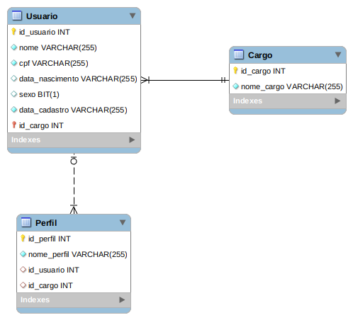

# **Desafio Prático Zetta**

## Gerenciamento de Usuário
---------------------------

### Linguagens utilizadas:
- Java
- Javascript

### Banco de Dados utilizado:
- MYSQL

### Sistema de controle de versões:
- Git

### Arquitetura adotada:
- MVC
  - Model src/main/java/com/project/zetta/models
  - View src/main/resources/templates
  - Controller src/main/java/com/project/zetta/controllers
### Framework utilizado:
- Spring

### Gerenciador de dependências:
- Maven

### Dependências:
- Spring Boot DevTools
- Lombok
- Spring Web
- Thymeleaf
- Spring Data JPA

### IDEs utilizadas:
- Visual Studio Code
- MYSQL Workbench
-----------------------------------
### Esquema conceitual do Banco de Dados

